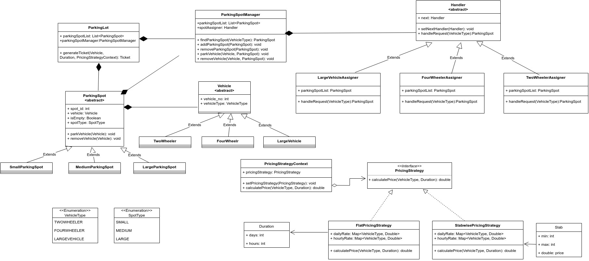

# Parking Lot Design LLD
## Step1: Funtional Requirements:
1. The parking lot should have the capacity to park vehicles. 
2. The three different types of parking spots are  small, large, and medium. 
3. Three types of vehicles should be allowed to park in the parking lot, which are as follows:
two-Wheeler, four-wheeler, large.
5. Customers should be able to collect a parking ticket from the entrance and pay at the exit. 
 <I>[I have implemented generating ticket and payment functionality in client code, in future I can create separate class for entrance and exit and handle these scenarios inside those accordingly.]</I>
6. Support dynamic and slab-wise pricing. For every vehicle type, we could have hourly or daily wise price.

## Step2: Identify Classes and Objects:
1. ParkingLot
2. ParkingSpot
3. SmallParkingSpot [extends ParkingSpot]
4. MediumParkingSpot [extends ParkingSpot]
5. LargeParkingSpot [extends ParkingSpot]
6. Vehicle
7. TwoWheeler [extends Vehicle]
8. FourWheeler [extends Vehicle]
9. LargeVehicle [extends Vehicle]
10. VehicleFactory
11. Handler [for assigning appropriate Spot]
12. TwoWheelerSpotAssigner [extends Handler]
13. FourWheelerSpotAssigner [extends Handler]
14. LargeVehicleAssigner [extends Handler]
15. Ticket
16. PricingStrategyContext
17. PricingStrategy [interface]
18. FlatPricingStrategy [extends PricingStrategy]
19. SlabwisePricingStrategy [extends PricingStrategy]
20. Slab
21. Duration
22. VehicleType [Enum]
23. SpotType [Enum]
24. ParkingSpotManager

## Step3: Applied Design Patterns:
### Factory Method Pattern
Vehicle [abstract] 
TwoWheeler [extends Vehicle] 
FourWheeler [extends Vehicle] 
LargeVehicle [extends Vehicle] 
VehicleFactory 

### Chain of Responsiblilty Pattern
<I>To assign right spot based on vehicle type.</I>
Handler [abstract] 
TwoWheelerSpotAssigner [extends Handler] 
FourWheelerSpotAssigner [extends Handler] 
LargeVehicleAssigner [extends Handler] 

### Strategy Pattern
PricingStrategyContext 
PricingStrategy [interface] 
FlatPricingStrategy [extends PricingStrategy] 
SlabwisePricingStrategy [extends PricingStrategy] 

## UML

