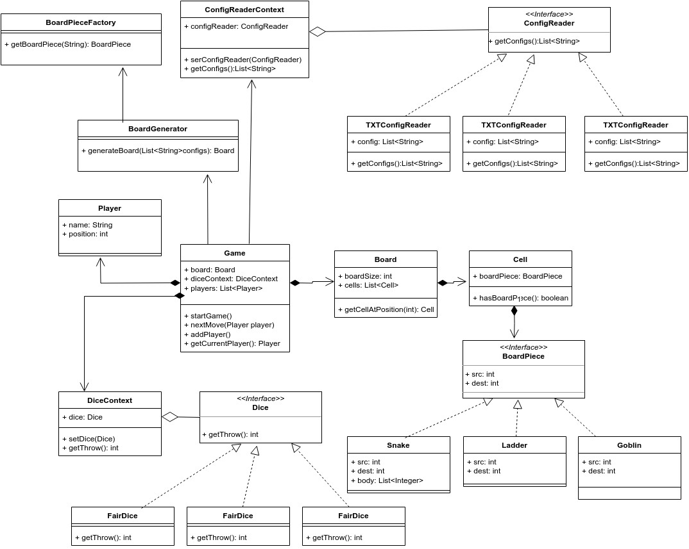

# Snake and Ladder Game LLD:
## Step1: Functional Requirements:
1. Design for 10 x 10 Board.
2. Number fo players should be 2-5 players turn based game.
3. Generate dynamic board by reading config file.
4. We will have only 1 dice.
5. Game ends when the 1st player reaches 100.
#### Good to have:
6. Code should be extensible to cater to new game pieces (goblin + Orc) .
7. Classes should be extensible.
8. Read different types of config.

## Step2: Identify Classes and Objects:

1. Game
2. Board
3. Cell
4. Player
5. Dice - interface
6. BoardPiece - interface
7. Snake implements BoardPiece
8. Ladder implements BoardPiece
9. Goblin implements BoardPiece
10. ConfigReader - interface
11. TXTConfigReader implements ConfigReader
12. XMLConfigReader implements ConfigReader
13. JSONConfigReader implements ConfigReader
14. ConfigReaderContext
15. BoardGenerator
16. BoardPieceFactory

## Step3: Apply Design Patterns:
### Strategy Design Pattern
a) 
interface Dice 
FairDice 
BiasedDice 
SuperDice 
DiceContext  
b) 
interface ConfigReader 
XMLConfigReader 
TXTConfigReader 
JSONConfigReader 
ConfigReaderContext 
### Factory Method Patten
BoardPiece - interface 
Snake implements BoardPiece 
Ladder implements BoardPiece 
Goblin implements BoardPiece 
BoardPieceFactory 

## UML
